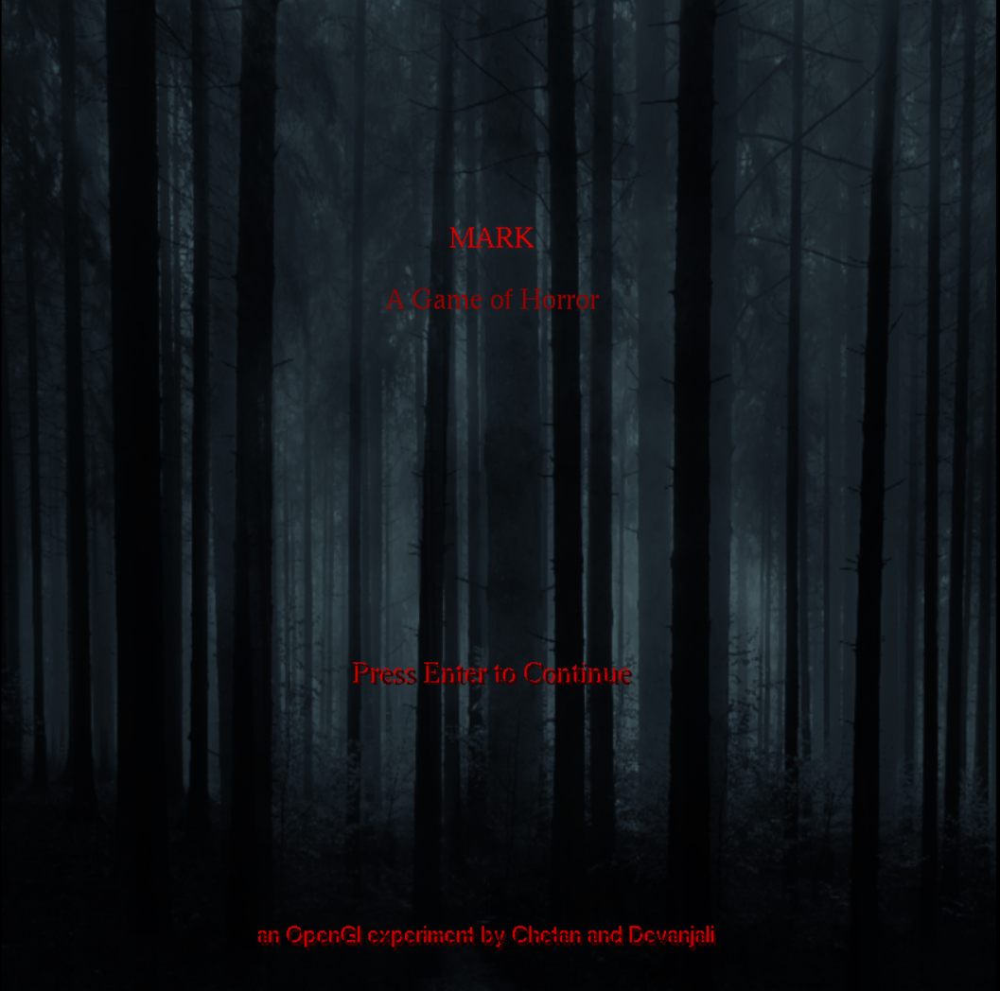
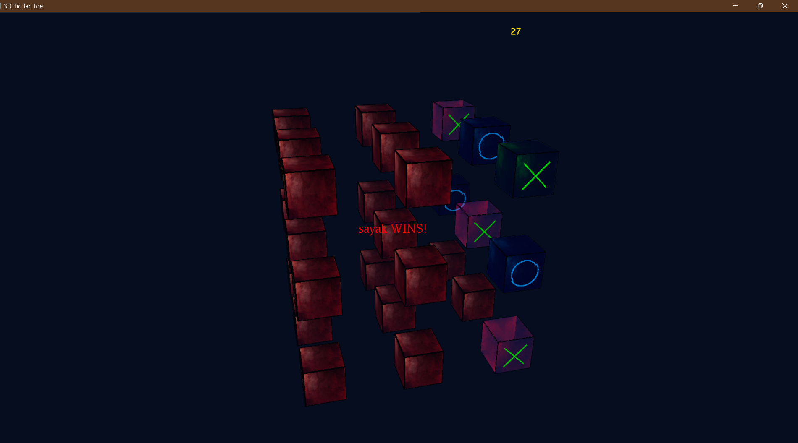
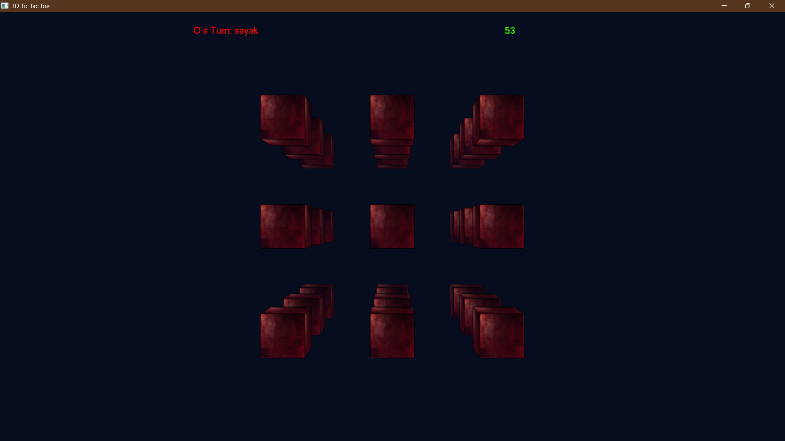

# 🎮 Mark³ - a 3D-TicTacToe Experience (OPENGL)

A cinematic horror experience built on top of a classic game — **Tic-Tac-Toe**, but in **3D** and with a dark twist. This C++ OpenGL project immerses players in a tense, time-limited psychological duel with visual and sensory feedback.

<p align="center">
  
</p>

---

## 🧩 Features

- 🧠 **3D 3x3x3 Tic-Tac-Toe** grid logic
- 😨 **Horror atmosphere**: ambient camera shake, minimal UI, analog effects
- 🧍 **Player name input overlay** at game start
- 🌀 **Mouse-driven camera rotation**
- 🎯 **Quick perspective switches** via number keys (1–6)
- 💥 **Smooth win detection** with cube highlighting and auto-reset
- ⌛ **Inactivity countdown** → triggers a **Game-Over**
- 🔊 Audio & Music integration via **Windows.h/mmsystem.h**

---

## 🧰 Dependencies

| Library           | Purpose                               | Required   | Notes                                   |
|-------------------|---------------------------------------|----------- |-----------------------------------------|
| **OpenGL**        | Core rendering                        | ✅        | Preinstalled on most platforms           |
| **GLUT/FreeGLUT** | Window creation, input, main loop     | ✅        | Use FreeGLUT for modern features         |
| **GLU**           | OpenGL utilities                      | ✅        | Generally bundled with OpenGL            |
| **stb_image.h**   | Texture loading                       | ✅        | Header-only, include manually            |
| **Windows.h**     | Audio playback                        | ✅        | Future support for music/sfx             |
| **SOIL**	        | Texture loading (PNG, JPG, etc.)      | ✅	       | Lightweight, great for loading images over 3D objects
---

## 💻 Build Instructions

### ✅ Option 1: Visual Studio (Windows)

1. **Install [vcpkg](https://github.com/microsoft/vcpkg):**
   ```bash
   git clone https://github.com/microsoft/vcpkg
   cd vcpkg
   .\bootstrap-vcpkg.bat
   ```

2. **Install dependencies:**
   ```bash
   .\vcpkg install freeglut stb soil
   ```

3. **Integrate with Visual Studio:**
   ```bash
   .\vcpkg integrate install
   ```

4. **Open** `1.sln` and **build the project**.

---

### 🧪 Option 2: CMake (Cross-platform)

```bash
# Clone and create build directory
git clone https://github.com/yourusername/TicTacToe-
cd TicTacToe-
mkdir build && cd build

# Generate build files (make sure vcpkg toolchain is used if needed)
cmake .. -DCMAKE_TOOLCHAIN_FILE=[vcpkg_root]/scripts/buildsystems/vcpkg.cmake
cmake --build .
```

---

## 🎮 Controls

| Key              | Action                             |
|------------------|-------------------------------------|
| **Mouse Drag**   | Rotate camera around 3D grid        |
| **Arrow Keys**   | Adjust camera rotation manually     |
| **1–6**          | Snap to preset camera views         |
| **Mouse Left**   | Place your symbol (X/O)             |
| **ESC**          | Exit the game                       |

---

## 📦 Future Roadmap

- 🔊 Sound effects and ambient music
- 💡 Dynamic lighting & shadows
- 🧛 AI opponent with increasing difficulty
- 🌌 Skybox & shader-based horror visual effects
- 📽️ Video intro sequence before game start
- 💾 Save/Load horror progress (?!)

---

## 🛠️ Technical Highlights

- Uses **GLUT's idle function** for animation timing.
- Camera movement utilizes **eased interpolation** (smoothstep) and **subtle vibration**.
- Win detection scans **49 potential victory lines** in a 3x3x3 grid.
- **Jumpscare logic** uses `glutTimerFunc` for delayed triggering.
- Modular design — extendable into a full horror experience.

---

## 📸 Screenshots

<p float="left">
  
  
</p>

---

## 📃 License

This project is licensed under the MIT License. See `LICENSE` for more details.

---

## 🧛 About

Created by [cbbisht2004] as a blend of classic gameplay and horror storytelling. If you enjoy analog horror, unsettling visuals, and psychological tension — this game is for you.

Feel free to fork, modify, and build your own horror stories atop this foundation.

---

> _“No one wins in this game. The board resets... but the names remain.”_
